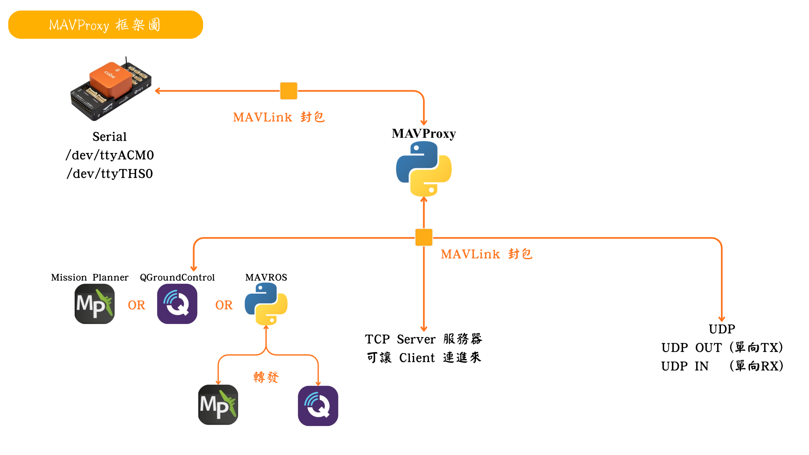
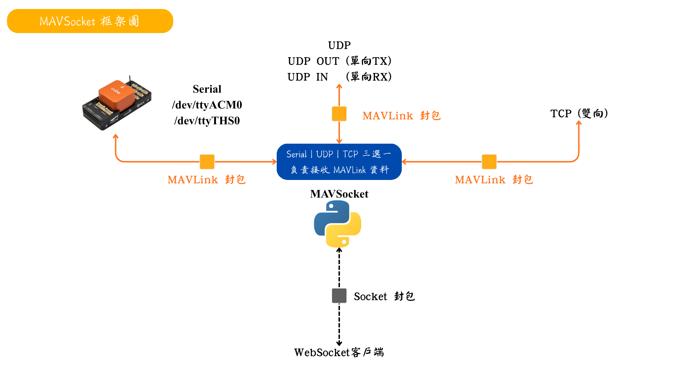
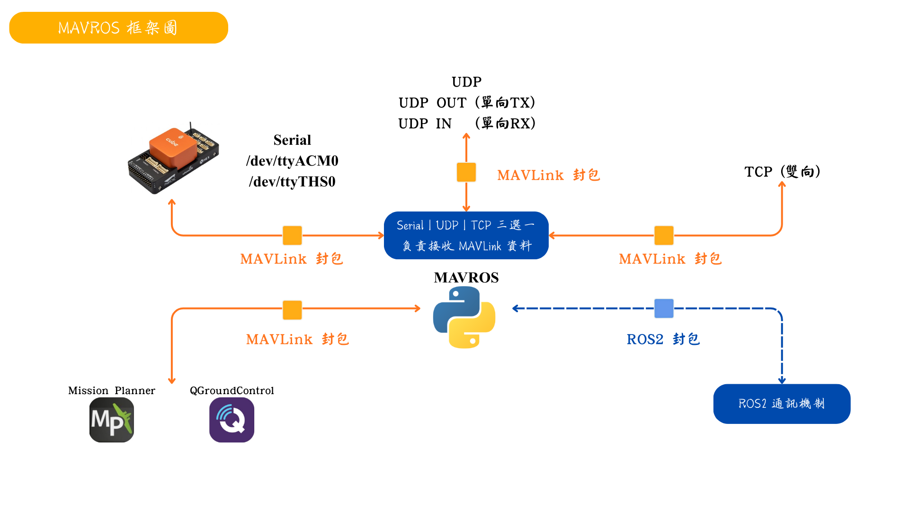
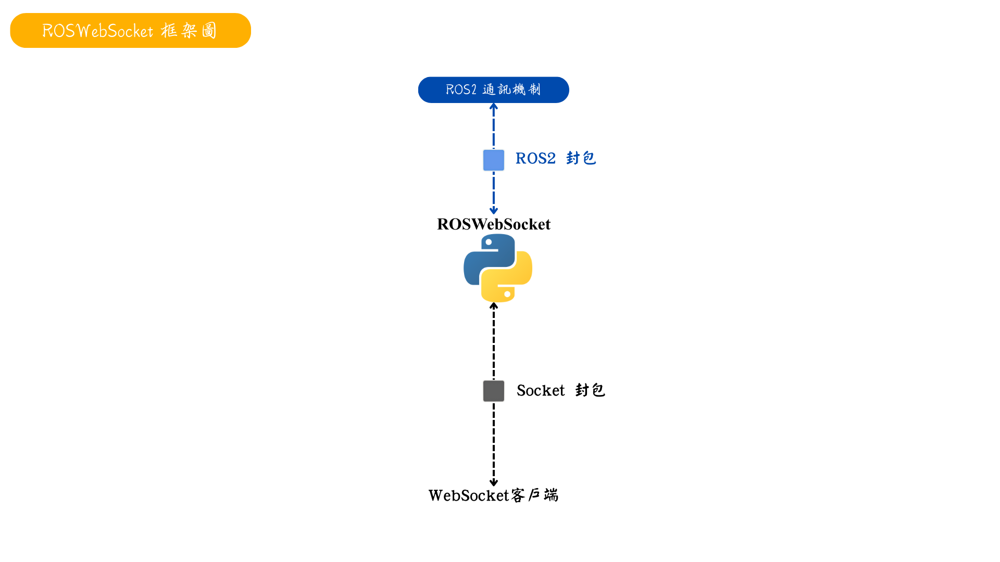
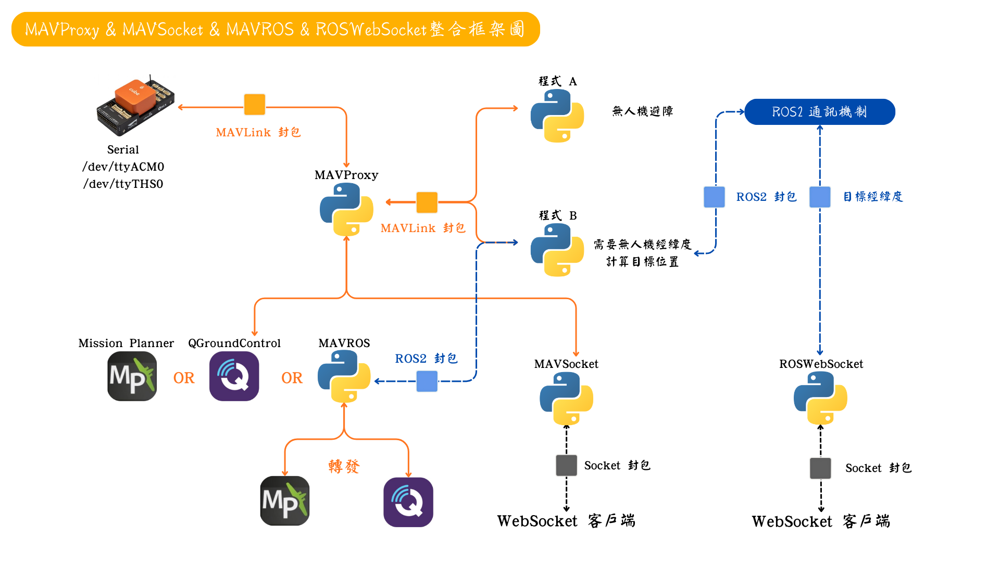

# 
通訊框架圖

## 
Outline

- [MAVProxy](#mavproxy)
- [MAVSocket](#mavsocket)
- [MAVROS](#mavros)
- [ROSWebSocket](#roswebsocket)
- [Integration-Framework](#integration-framework)

## 
MAVProxy

---

## 
MAVSocket

---

## 
MAVROS

---

## 
ROSWebSocket

---

## 
Integration-Framework

---